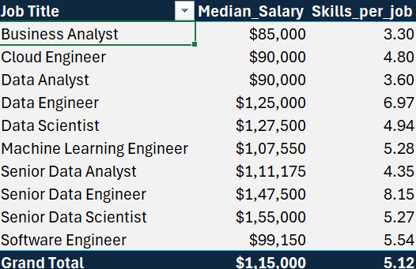
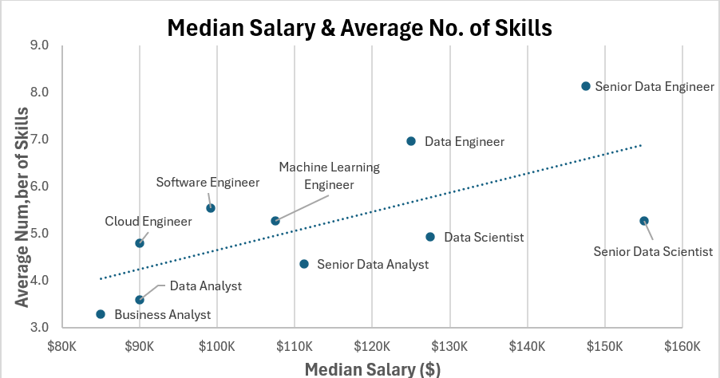
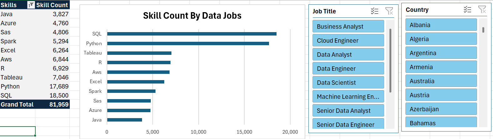
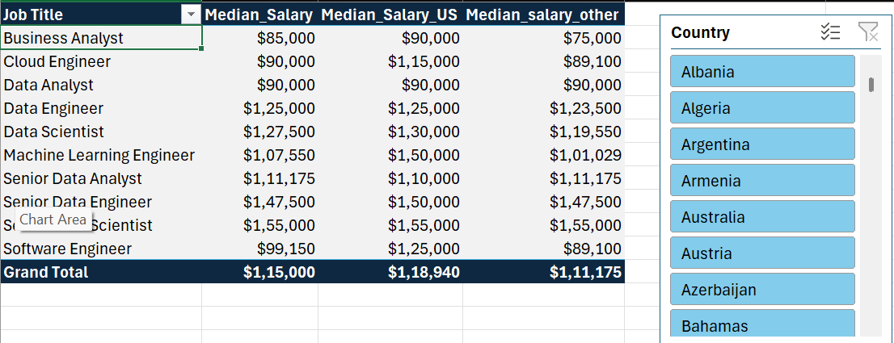
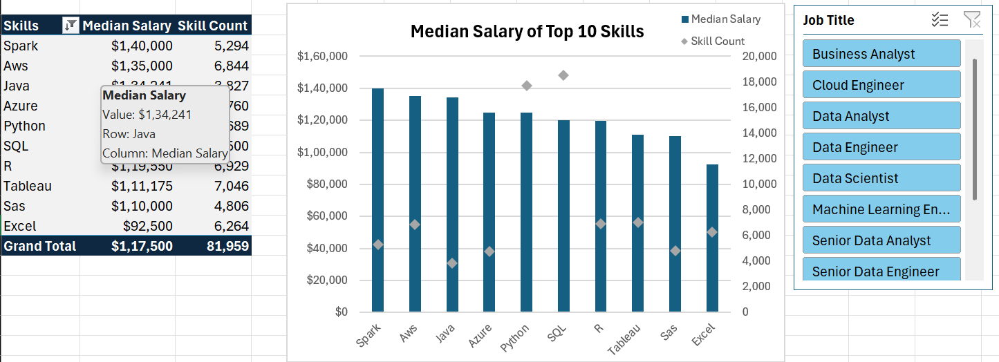

# 🚀 The Data Behind Data Jobs: Skillsets and Salary Insights
**This project explores how different skills influence salary variations in data-related jobs, uncovering key insights and industry trends.**

## OVERVIEW 
This project aims to analyze and uncover insights into how different skills impact salaries in data-related jobs. By exploring real-world data, the project highlights trends and patterns that show how specific technical and analytical skills are associated with varying salary levels. The goal is to understand which skills are most valued in the data industry and how they influence earning potential.

**Download my excel project from here** - my_project.xlsx

## 📊 Data Description
The dataset used in this project was sourced from Luke Baraouuse's Excel course, containing job listings with the following columns:

Job Title: The title of the job position (e.g., Data Scientist, Data Analyst).

Salary: The salary range or value for the position.

Location: The location where the job is being offered (e.g., San Francisco, New York).

Skills: The skills required for the role (e.g., Python, Machine Learning, SQL).

Job Type: Job Type whether it's full time, part time or remote.

Company: The name of the company offering job.

### 📈 Excel Skills Utilized:

- Charts: Used to visually represent salary distributions across various skill sets.

- Pivot Tables: Enabled dynamic summarization and categorization of job roles, skills, and salaries.

- Pivot Charts: Provided interactive visuals to compare salary trends by skills.

- DAX (Data Analysis Expressions): Applied for custom calculations and deeper data insights.

- Power Pivot

## 1.📝 SALARY VS. SKILLS

This report provides valuable insights into the median salaries and the average number of skills required across various data-related job titles. It also highlights a positive correlation between the number of skills a professional possesses and their salary, suggesting that a broader skill set is often associated with higher earning potential in the data industry.

### 🧠 KEY INSIGHTS :

1. **More Skills, Higher Salary:**
   There's a clear positive trend between the number of skills and salary across data roles.

2. **Senior Roles Pay the Most:**
   Senior Data Scientist and Senior Data Engineer top the salary chart, exceeding \$145K.

3. **Entry Roles Have Fewer Skills:**
   Business Analyst and Data Analyst require fewer skills and earn lower median salaries.

4. **Skill Depth Over Quantity:**
   Some high-paying roles (e.g., Senior Data Scientist) achieve top salaries with fewer, likely more specialized, skills.

## 2.📝 SKILLS ANALYSIS 

This report provides insights into the distribution of skill counts across various data-related job roles. An interactive slicer is incorporated to allow users to filter and analyze the skill requirements for specific job titles, enabling targeted exploration and comparison.

### 🧠 KEY INSIGHTS :

1. **SQL and Python are Top Skills:**
   SQL (18,500) and Python (17,689) are the most in-demand skills across data jobs.

2. **Visualization Tools Are Essential:**
   Tableau and Excel show strong presence, highlighting the importance of data visualization.

3. **Cloud and Big Data Skills Rising:**
   AWS, Spark, and Azure have notable counts, reflecting the growing demand for cloud and big data expertise.

4. **Interactive Filters Enhance Analysis:**
   Slicers by Job Title and Country enable targeted skill demand analysis for specific roles and regions.

## 3.📝 MEDIAN SALARY ANALYSIS 

This report provides a comparative analysis of median salaries across various data-related job roles, segmented by country through an interactive slicer. It enables users to view country-specific salary data alongside benchmarks such as the U.S. median salary and the global median salary, offering valuable context for regional compensation trends in the data industry.

### 🧠 KEY INSIGHTS :

1. **Top Earners**: The highest median salary is for **Staff Data Scientist** at **\$155,000**, consistent across both the US and other countries.
2. **US Salary Premium**: Across nearly all roles, median salaries in the **US** are higher than those in **other countries**, with differences ranging up to **\$35,900** (e.g., Cloud Engineer).
3. **Business Analyst Lag**: **Business Analysts** have the **lowest global median salary** at **\$85,000**, with a significant gap between US (\$90,000) and other countries (\$75,000).
4. **Salary Consistency**: Roles like **Senior Data Analyst** and **Senior Data Engineer** show **minimal variation** between US and other countries, suggesting standardized global pay in these roles.

## 4.📝 TOP 10 SKILLS AND MEDIAN SALARY

This report presents key insights on the top 10 most in-demand skills across data-related job roles, based on skill frequency and associated median salaries. It analyzes how these skills align with compensation trends and job market demand. The inclusion of a Job Title slicer allows for dynamic filtering, enabling users to explore skill relevance and salary impact across specific roles.

### 🧠 KEY INSIGHTS :

1. **High-Paying Skills**: *Spark*, *AWS*, and *Java* top the list with median salaries exceeding **\$134,000**, indicating strong demand for cloud and big data engineering capabilities.

2. **Most In-Demand Skills**: *Tableau* (7,046), *SAS* (6,804), and *SQL* (6,890) have the highest skill counts, reflecting their widespread usage across data roles despite offering relatively lower median salaries.

3. **Salary vs. Demand Imbalance**: Skills like *Spark* and *Java* offer high compensation but have **lower skill counts**, suggesting a **talent gap** and premium pay for specialized expertise.

4. **Job Title Filter for Deeper Analysis**: The **Job Title slicer** enables tailored insights by role—allowing organizations to evaluate how skill value varies between positions like *Data Analyst* vs *Machine Learning Engineer*.

## 🧾 CONCLUSION :

This project provides a comprehensive analysis of the data jobs landscape by exploring the relationships between **skills, salaries, and job counts** across a variety of roles. Through interactive visualizations and slicers for job titles and countries, users can gain targeted insights into the current market dynamics.

The findings are especially valuable for **aspiring data professionals** who are just starting their careers. By identifying which **skills are in high demand** and which ones are associated with **higher salaries**, individuals can make more informed decisions about where to focus their learning and development efforts.

Whether you're a **Data Analyst in Australia** or a **Machine Learning Engineer in the US**, this tool enables you to explore relevant trends tailored to your career path and region—making it a practical resource for strategic career planning in the data field.

